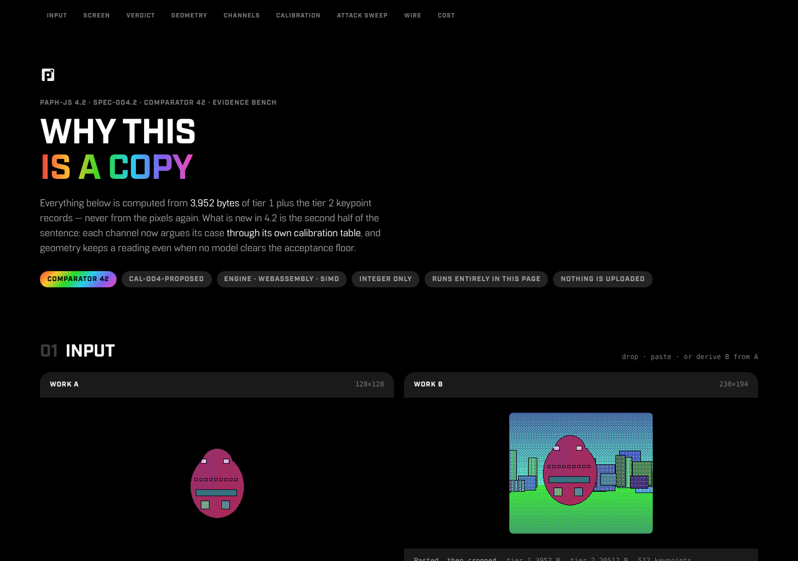
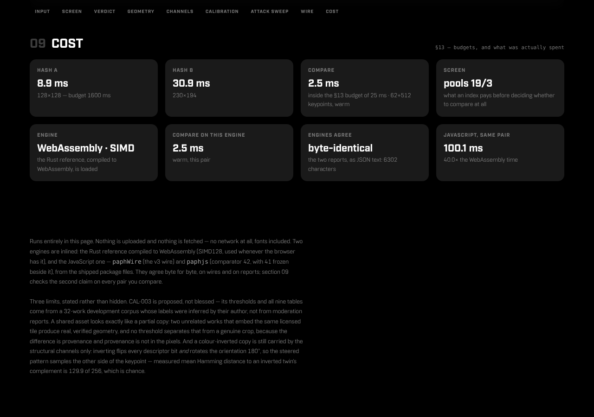

# PAPH-X — `@pixagram/paph-x`

**An integer-only perceptual fingerprint and a calibrated comparator for detecting copied pixel
art** — mirrored, cropped, rescaled, recoloured, pasted into something else — with the evidence
for every verdict, and **PAPH-X**, the retrieval-native cascade that reaches the same verdicts
through a cheaper path. This repository carries PAPH 4.2 whole — the evidence bench, the
JavaScript engine, the Rust reference rewritten for speed, the WebAssembly modules built from
it, the pieces for wiring it into a search engine — and PAPH-X beside it, sharing the wire, the
comparator-42 verdicts and the calibration.

Three builds of the engine — JavaScript, native Rust, Rust compiled to WebAssembly — produce the
**same wires and the same reports, byte for byte**. That is the design, not a nicety: an index, a
moderator's appeal and a dispute between two artists all rest on anyone being able to recompute
the same answer from the same bytes.



## The evidence bench

[`demo/paph4x.html`](demo/paph4x.html) — one self-contained file, no server, no network, fonts
included. Open it, drop two images (or derive B from A with a transform), and it walks through
everything comparator 42 measured: the screen, the verdict lattice, the geometric models, every
channel with its calibration table, an attack sweep, the wire itself, and the cost. It runs on
the WebAssembly engine, keeps the JavaScript engine beside it, and checks on every pair that the
two produce the same report.



The page is generated (`npm run build:bench`) from `demo/bench4x/` and the current engines, so it
cannot drift from the package.

## Use it

```js
import { init } from '@pixagram/paph-x/wasm';

const paph = await init();                         // SIMD128 build where available, baseline otherwise
const a = paph.hash(imageDataA);                   // { t1: 3952 B, t2: 32 + 40·kp B, … } — wire 4 (1.0–1.1 wrote 3: { wire: 3 })
const b = paph.hash(imageDataB);
const r = paph.compare(a, b);                      // the comparator-42 report
r.verdict;                                         // 'Copy'
r.class;                                           // 'certified — structure and geometry agree'
```

1.2 writes **wire 4** ([docs/SPEC-W4-paph-wire4.md](docs/SPEC-W4-paph-wire4.md)), and a wire-3
fingerprint from 1.0–1.1 is never compared with a wire-4 one (`Indeterminate`, `WIRE_MISMATCH`):
re-hash stored works (and store their PAPH-X sidecars again: 1.1's are refused), or hash with
`{ wire: 3 }` until you do. The index keys come out the same in both formats.

Many comparisons against one query — parse once, rank in one call:

```js
const q = paph.prepare(a.t1, a.t2, { strict: true });
const sides = rows.map(r => paph.prepare(r.t1, r.t2));
paph.rank(q, sides, { gate: true });               // [{ verdict, certifiable, structural, mirrored, … }]
```

The JavaScript engine has the same answers with no WebAssembly at all:

```js
import { hash, compare, cal } from '@pixagram/paph-x';
const profile = cal();
const x = hash(imageDataA, {}, profile.limits), y = hash(imageDataB, {}, profile.limits);
compare(x.t1, x.t2, y.t1, y.t2, {}, profile).verdict;   // 'Copy'
```

Cloudflare Workers import the module compiled: `import wasm from '@pixagram/paph-x/wasm/paph.wasm'`
then `await init(wasm)`. Other hosts (Python, Go, Rust services) drive the same module through
its C ABI — [docs/WASM-ABI.md](docs/WASM-ABI.md).

## PAPH-X: the same verdicts through a cheaper path

PAPH-X ([docs/SPEC-X-paph-x.md](docs/SPEC-X-paph-x.md), built as
[docs/PAPH-X.md](docs/PAPH-X.md)) keeps the wire, the comparator-42 verdicts and the
calibration, and reaches them through a six-stage cascade: a 128-byte route signature screened
first, descriptor matching by locality-sensitive buckets instead of the 512 × 512 Hamming
scan, geometry on 96 anchor keypoints that expands only when it must, structural channels
computed only while the verdict can still move, and comparator 42 itself as the fallback and
the audit. Every report says how its verdict was reached (`FAST`, `DEFERRED`, `FALLBACK`,
`AUDIT`).

```js
const a = paph.xprepare(fpA), b = paph.xprepare(fpB);   // route + bucket index + anchor order, once per side
paph.xscreen(a, b).state;                                // 'Reject' | 'Defer' | 'Pass' | 'Identical' — never a verdict
const r = paph.xcompare(a, b);                           // safe: 42's Copy answer, or certified; r.execution, r.reason
paph.xcompare(a, b, { policy: 'fast' });                 // never falls back; 'DEFERRED' where the cascade will not decide
paph.xrank(q, sides);                                    // one call: route table (SIMD) → sparse screen → cascade
```

Measured on the specification's corpus (2,379 pairs; `rust/target/release/xbench`,
`npm run bench:x`): zero copy disagreements with comparator 42 under the safe policy, zero false
Copies under fast, zero copies hard-rejected by the screen, 1.4 % fallbacks, 99 % fewer descriptor
pairs evaluated, zero allocations in the screen. In 1.2's run the reference search workload (a
512-keypoint query against 100 busy candidates) runs **3.2×** faster than comparator 42's ranking
natively and 3.3× in WebAssembly, and the fast-path compare 10.5× faster at p50; the pairwise
screen is 4.7× faster at p95 and 1.0× at p50, where the structural door is paid. (1.0.0's run,
under X1 and with a slower comparator 42, measured 7.1×, 26× and 15×.) On the PAPH-SI corpus's 995
comparator-42 copies, XRank shown the target alone reads Copy on every one, in both arrival
orders. On the Pixa chain's own artworks (177 works read from the chain, 3,095 comparator-42
copies made from them) it reads Copy on every copy and on none of the 31,148 queries between
distinct works that comparator 42 does not call Copy, at 0.65 ms a candidate natively against
1.10 ms for comparator 42's gated ranking (1.7×). The specification's ≥ 10× release gates are
**not** met and not claimed; the gate table, the per-class numbers and the known gaps are in
[docs/PAPH-X.md](docs/PAPH-X.md). The shipped profile, X3, is X2's schedule bound to comparator
42's 1.2 calibration (CAL-007); it is provisional — calibrated on a synthetic corpus, measured on
the chain's works, not yet on a moderation corpus. An exit from its anchor expansion, which 1.1.2
proposed, was measured in 1.2 and rejected: some copies find their geometry only after the anchor
tier (see [CHANGELOG.md](CHANGELOG.md)).

## PAPH-SI: which stored works are worth comparing

PAPH-SI ([docs/SPEC-SI-paph-si.md](docs/SPEC-SI-paph-si.md)) is the screening index in front of
XRank: six transformation-stable feature families read from the wire — stroke texture,
luminance topology, palette population, quantile-band regions, silhouette, keypoint layout —
each quantised into a 16-coarse / 256-fine cell hierarchy, plus XRoute's MinHash lanes banded
into keys. A 104-byte signature and ~45 postings per work; a candidate is scored by the summed
evidence of the families it agrees on, never required to agree on all of them.

```js
const index = paph.siindex();                 // in memory; or SQLite / D1 with SI_SQL.schema
const sig = paph.sisig(fp);                   // ingest, from the wires { t1, t2 }: 104 bytes + posting keys
const slot = index.add(sig.bytes);            // in SQL: one si_works row, sig.keys as si_postings rows
const q = paph.siquery(upload);               // an XSide (xprepare) or { t1, t2 }
index.query(q).hits;                          // [{ slot, score }], best first
db.prepare(SI_SQL.query).all(...siSqlParams(q.plan()));   // the same answer from SQLite / D1
```

Measured on the synthetic corpus (comparator-42 copies, wire 3, profile SI2; SPEC-SI §9):
requiring shape, palette and structure to agree keeps 74 % of copies at 698×; PAPH-SI's score
keeps 92 % at 70× and 90.5 % at 98×; **in union with the exact keys, 99.8 % at 4,000 works** —
XRank returns Copy on all of them end to end — **and 98.8 % at 104,000** (97.0 % with SI's pool
cut to its default 2,000). On the Pixa chain's own works SI2 admits half of all pairs, so 1.1.2
shipped SI3, fitted on them (`sibench chainfit`; `npm run bench:chain` reruns the measurement),
and 1.2 ships **SI4**, the same fit on the works hashed in wire 4 — where the shape and silhouette
families land in the same cells for a work and all its mirror images and quarter turns. Fitted on
half of the works it admits 0.5–0.9 % of the other half's unrelated pairs and keeps 85 % of their
copies, and SI4 with the exact keys nominates **99.6 %** of copies (in-sample). SI4 is
provisional: 174 works at one snapshot of the chain, to be re-fitted as it grows.

## Faster, with the same bytes

| | before | after |
|---|---:|---:|
| hash a 288×200 scene, native | 49.0 ms | **12.4 ms** |
| hash a 1024×768 scene, native | 1112 ms | **161 ms** |
| comparator 42, scene × mirrored, native | 14.5 ms | **3.46 ms** |
| hash a 288×200 scene, WebAssembly (vs `paph-js` 4.2.2's module) | 77.3 ms | **16.3 ms** |
| comparator 42, scene × mirrored, WebAssembly (vs the JavaScript engine — 4.2.2's module had no comparator 42) | 68.9 ms | **5.55 ms** |
| descriptor scan per pair, WebAssembly | 7.8 ns | **2.6 ns** |

Every one of these changes is output-identical: a 3,160-case equivalence digest — every
transform, sixteen hash configurations, every comparator, corrupt wires, the JSON reports — is
byte-identical before and after, natively and inside both WebAssembly builds, and 625 ordered
pairs give byte-identical report text in JavaScript and WebAssembly. (The table is 4.2.3's
measurement, on wire 3; wire 4 hashes within 9 % of wire 3's time either way, and a second digest,
3,164 cases, holds wire 4 to the same discipline.) [docs/PERFORMANCE.md](docs/PERFORMANCE.md) has
the full tables and what changed.

## Wiring it into a search engine

PAPH compares pairs; a search engine needs to find, among N works, the few worth comparing. The
answer is retrieve-then-verify, with PAPH supplying both halves:

1. **Fingerprint at ingest** — `hash()`, store both tiers (≤ 24.5 KB).
2. **Index exact-match keys** — `indexKeys()` derives Tier-1 local codes (canonical under the
   square's symmetries and inversion) and 24-bit descriptor bands; integers in any store.
3. **Nominate** — score works sharing keys with a query by Σ 1/df, keep the top 32 per family,
   union with PAPH-SI's candidates (`siquery`, SQL or in memory) and whatever else you have
   (pHash, embeddings).
4. **Verify** — `rank(query, candidates, { gate: true })`; the comparator decides, and its report
   is the evidence. The gate passes a pair only on 8 keypoint correspondences or more, so it
   drops every copy of a work with fewer keypoints and some others — 194 of 995 comparator-42
   copies on the PAPH-SI corpus, 9 of 3,095 on copies of the chain's works (wire 4; 1.1's wire 3:
   178 of 976 and 8): `gate: false`, or `xrank` (X3), keeps them.

Measured on the test corpus (eight originals, 200 same-style distractors), the keys nominate the
original of every mirrored, rotated, cropped, upscaled and inverted copy from either side of the
pair, and of 15 in 16 pasted ones.
[docs/SEARCH.md](docs/SEARCH.md) is the design, the SQL and the numbers;
[integrations/pixagram-search](integrations/pixagram-search/README.md) is a complete
implementation for the Pixagram search Worker on Cloudflare — queue stage, a Durable Object
index that runs the comparator next to the fingerprints, verdicts in D1, `/copies` API, tested
end to end in workerd.

## Layout

```
demo/paph4x.html          the evidence bench (generated) · demo/bench4x/ its sources
src/                      the JavaScript engine: wire.cjs (fingerprints), paph-js.cjs (comparators)
rust/                     the Rust reference (crate `paph`, no dependencies)
  src/abi.rs              the C ABI the WebAssembly build exports
  src/equiv.rs            the equivalence digest      check.sh  bench.sh
  src/x/                  PAPH-X: route, bucket, anchor, matcher, geom, structural, compare, rank,
                          prepared, sidecar, profile, abi
  src/x/si/               PAPH-SI: features, profile, code (cells, probes, score), index, fit, abi
  src/bin/                xbench (the §33–35 harness) · sibench (PAPH-SI) · xprof · xcli · prof · paphcli · paph-equiv
wasm/                     paph.wasm (SIMD128), paph-baseline.wasm, paph.js (glue), paph.d.ts
index.js · index.cjs      the package entry (JavaScript engine + wasm())
docs/                     SPEC-003, SPEC-W4, SPEC-004, SPEC-004.1, SPEC-004.2, SPEC-X, SPEC-SI · PAPH-X ·
                          PERFORMANCE · SEARCH · WASM-ABI · calibration/ (.pcal, .pxcl, .psi artefacts and the
                          runs behind them) · golden/ (conformance vectors: GOLDEN-004, GOLDEN-W4)
integrations/             pixagram-search: the Cloudflare integration as a patch
test/                     suites, parity, benchmarks, recall · wire4-golden.cjs, wire4-parity.mjs (wire 4) ·
                          x-wasm.mjs, x-bench.mjs (PAPH-X) · si-wasm.mjs (PAPH-SI)
tools/                    build-wasm.sh · build-paph4x.mjs · gen-corpus.mjs · chain-corpus.mjs (the Pixa chain's
                          artworks) · cal-lattice.py (comparator 42's lattice on calibration snapshots) ·
                          silhouette-ties.cjs (the ties wire 4's silhouette can meet)
```

## Build and verify

```bash
npm install                 # jsdom (bench test), binaryen (wasm-opt)
npm test                    # wire + comparator suites, wire 4's golden vectors (JavaScript engine and both WebAssembly builds)
npm run test:rust           # cargo build + both equivalence digests: wire 3 (3,160 cases, 1.0–1.1's) and wire 4 (3,164)
npm run test:native         # native reference vs JavaScript, field for field
npm run test:wire4          # wire 4: JavaScript vs native, byte for byte, every image and its mirror, quarter and half turns, both formats
npm run build:wasm          # both WebAssembly builds (rustup target add wasm32-unknown-unknown)
npm run test:equiv          # the digest computed inside both WebAssembly builds
npm run test:wasm           # 625 ordered pairs, JavaScript vs WebAssembly, byte for byte
npm run build:bench         # regenerate demo/paph4x.html
npm run test:bench          # the bench, headless, on both engines
npm run bench               # engine timings          npm run recall   index-key recall
npm run test:x              # PAPH-X: native xcli vs both WebAssembly builds, symmetry, exactness, rank, sidecar
npm run bench:x             # PAPH-X timings in WebAssembly;  rust/target/release/xbench  the native harness
npm run test:si             # PAPH-SI: native vs both WebAssembly builds, index = definition, SQL = index
npm run bench:si            # PAPH-SI: rust/sibench.sh — stability, recall vs reduction, funnel (--big: scaling)
npm run bench:chain         # the same on the Pixa chain's artworks (fetched on first use; npm install for the decoders)
```

`test:equiv` needs the digest-exporting builds: `tools/build-wasm.sh --equiv`.

## Versions

| layer | version | changes when |
|---|---|---|
| wire | **4** — SPEC-003's layout (Tier 1 3952 B, Tier 2 32 + 40n B, n ≤ 512, eleven sections, CRC-32), the DCT, the shapes and the silhouette sampled so a mirror or a quarter turn moves them exactly ([SPEC-W4](docs/SPEC-W4-paph-wire4.md)); **3**, 1.0–1.1's, byte for byte, on request (`wire: 3`); a mixed pair is refused | only with a new wire specification; every work re-hashed |
| comparator | **42** (SPEC-004.2); 41 frozen beside it; PAPH-X reports as **50** with 42's vocabulary | when the evidence says the judgement should |
| calibration | **CAL-007-PROVISIONAL** (CAL-004 with the moderate structural bar at 3300, fitted on the chain's works), identified by its SHA-256; PAPH-X profile **X3-PROVISIONAL** bound to it (1.1's X2 and 1.0's X1, bound to CAL-004-PROPOSED, beside them) | whenever a corpus is re-derived |
| index keys | **KEYS_VERSION 1** | re-derive keys from stored wires; nothing is re-hashed |
| screening index | **SI ABI 1**, feature derivation 1, profile **SI4-PROVISIONAL** bound to X3, fitted on the Pixa chain's works hashed in wire 4 (SI3, SI2 and SI1 beside it) | re-derive signatures from stored wires; nothing is re-hashed |
| WebAssembly ABI | **4** (ABI 3 with the wire format as the 22nd configuration field; X ABI 1 and SI ABI 1 unchanged) | |

`@pixagram/paph` numbered its releases by the comparator (4.2.3: comparator 42 with engines that
are faster and agree in four more places). `@pixagram/paph-x` starts over at **1.0.0**: that
package, renamed, with PAPH-X beside it and nothing of 4.2.3 changed — comparator 42,
CAL-004-PROPOSED, ABI 3 / X ABI 1, profile X1-PROVISIONAL; 1.1.0 adds PAPH-SI beside them; 1.1.1
ships profile X2 and addresses three screen problems without moving the wire, comparator 42 or the
calibration; 1.1.2 measures PAPH-X and PAPH-SI on the Pixa chain's own artworks and ships the SI
profile fitted on them, SI3; 1.2.0 ships what 1.1.2 found a patch could not — wire 4, the
calibration CAL-007 and the profiles X3 and SI4 — and every stored work is re-hashed (see
[CHANGELOG.md](CHANGELOG.md)).

## License

MIT — Pixagram SA.
